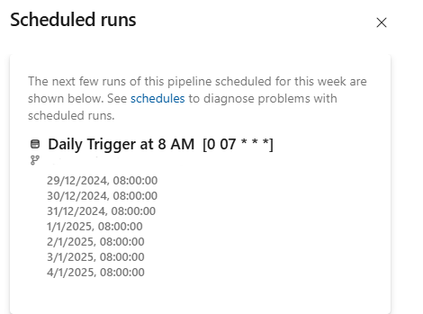

### Following schedule in my yaml file didn't work. Do you see the problem?

```yaml
schedules:
- cron: "0 7 * * *"  
  displayName: Daily Trigger at 6 PM
  always: true        
  branches:
  include:
    - refs/heads/YourBranch
````

### Apparently when adding a trailing zero to the 7 fixes the issue.

```yaml
schedules:
- cron: "0 07 * * *"  
  displayName: Daily Trigger at 6 PM
  always: true        
  branches:
  include:
    - refs/heads/YourBranch
````



Resources

https://learn.microsoft.com/en-us/azure/devops/pipelines/process/scheduled-triggers?view=azure-devops&tabs=yaml

Hopefully this saves you some time!