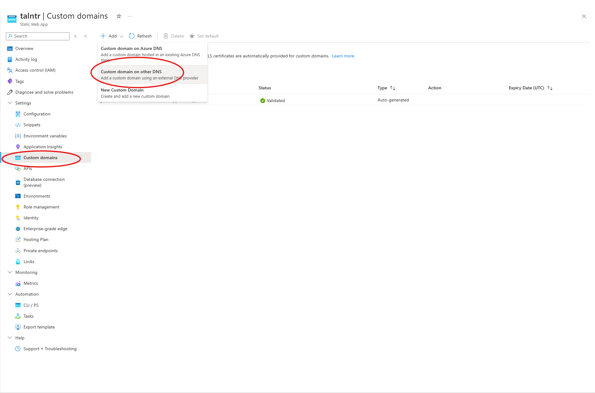
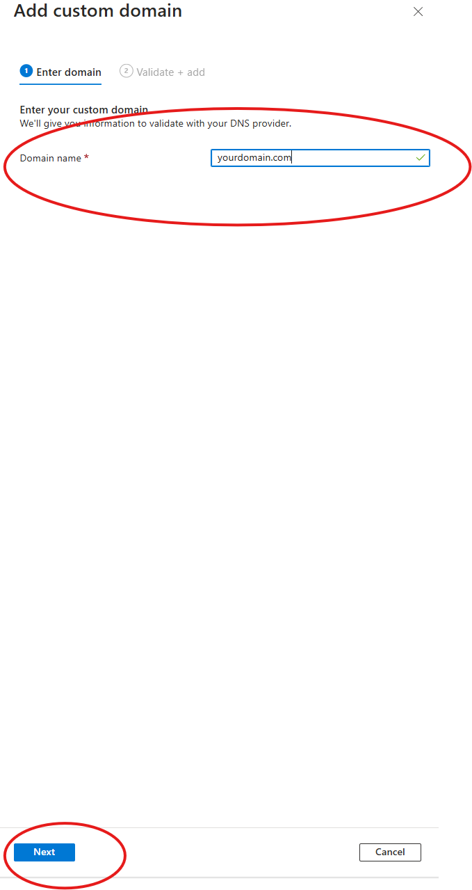
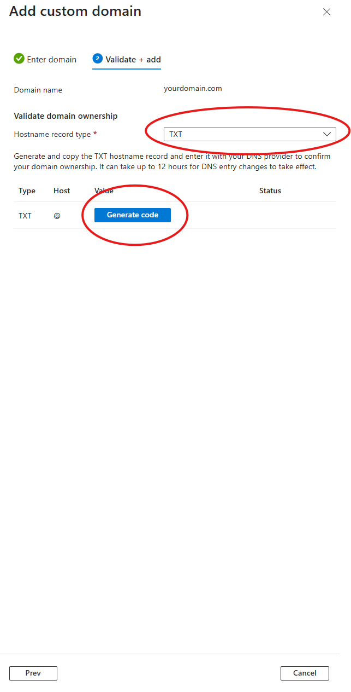
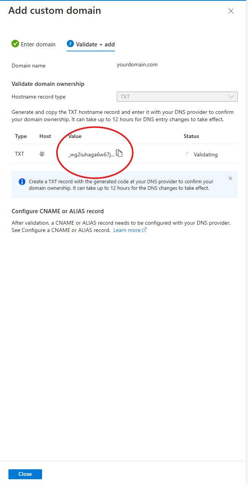
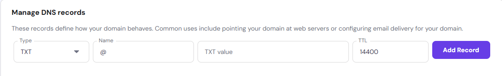
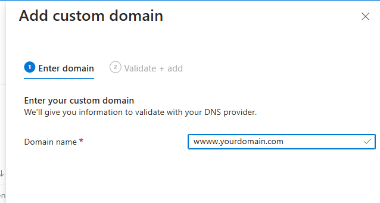
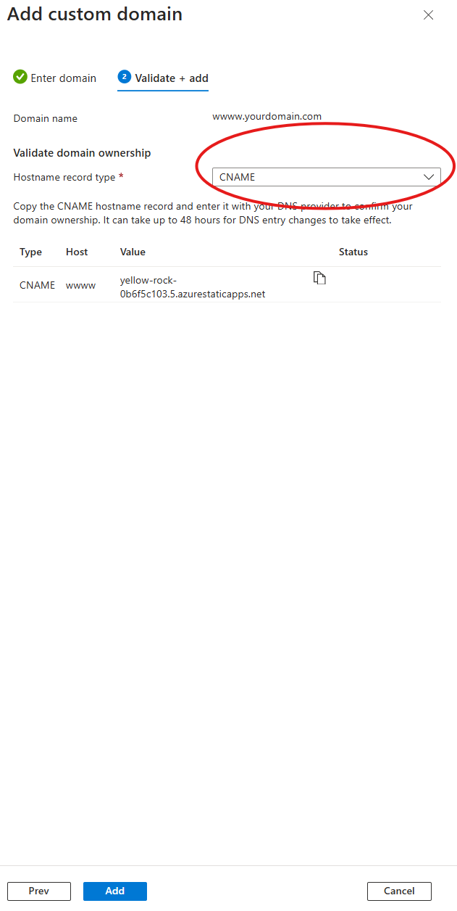
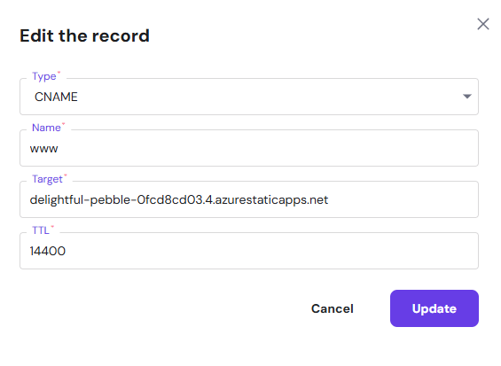
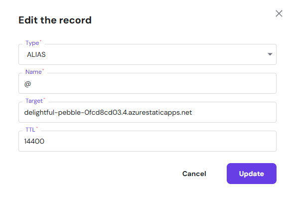

Configuring a custom domain for your Azure Static Web App is straightforward. Follow these simple steps to get your website running on your own domain.

## Step 1: Open the Custom Domains Page
Go to your Azure Static Web App in the Azure Portal. From the left-hand menu, click on **Custom domains**.

## Step 2: Add a Custom Domain
Click the **Add** button and choose the option for **Custom domain on other DNS**.

## Step 3: Verify Your Domain
To verify your domain, you need to add a TXT record to your DNS provider.

Copy the generated TXT record value and paste it into your DNS provider’s settings. This unique value provides a valid connection between Azure and your DNS provider.

For example, if you use Hostinger, it might look like this:

## Step 4: Add a WWW Subdomain
Repeat the process, but this time use **www.yourdomain.com** instead of **yourdomain.com**.

## Step 5: Configure CNAME Records
In the Azure portal, select **CNAME** and click the **Add** button at the bottom of the screen.

In your DNS provider’s settings, add or edit the following CNAME records:

1. For **www.yourdomain.com**:

   

2. For the root domain (yourdomain.com), add an alias (CNAME):

   

These configurations make sure your website works with both **www** and without it.

## Done!
That’s it! Your custom domain is now linked to your Azure Static Web App. Enjoy!

---

